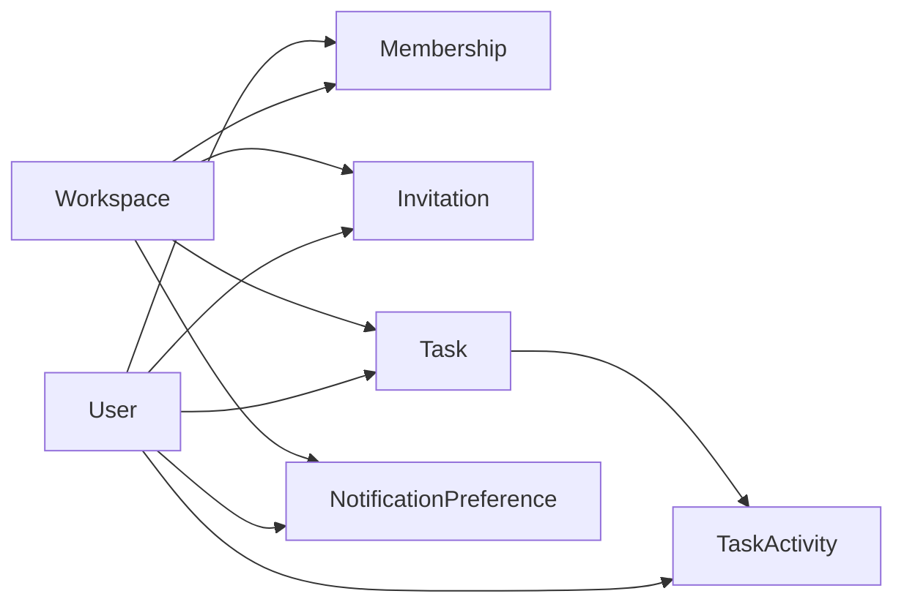

# TaskBridge Domain Model (MVP v1)

## Scope
This model supports a web-first MVP with an API contract reusable by future iOS and Android apps.

## Locked Product Decisions (from PRD v2.0)
- Workspace visibility: all workspace members can read all tasks in that workspace.
- Workspace size: maximum 5 members (active + invited).
- Reminders (MVP): one reminder at 24h before due date (48h deferred).

## Entity Overview
- `User`
- `Workspace`
- `Membership`
- `Invitation`
- `Task`
- `TaskActivity`
- `NotificationPreference`

## Entities

### User
- `id` (uuid, pk)
- `email` (varchar(320), unique, required)
- `name` (varchar(120), required)
- `avatar_url` (text, nullable)
- `auth_provider` (enum: `email`, `google`)
- `created_at` (timestamptz, required)
- `updated_at` (timestamptz, required)

### Workspace
- `id` (uuid, pk)
- `name` (varchar(100), required)
- `created_by_user_id` (uuid, fk -> `user.id`)
- `created_at` (timestamptz, required)
- `updated_at` (timestamptz, required)

### Membership
- `id` (uuid, pk)
- `workspace_id` (uuid, fk -> `workspace.id`)
- `user_id` (uuid, fk -> `user.id`)
- `role` (enum: `admin`, `member`)
- `status` (enum: `active`, `invited`, `removed`)
- `joined_at` (timestamptz, nullable)
- `created_at` (timestamptz, required)

Constraints:
- unique (`workspace_id`, `user_id`)
- business rule: count(`active` + `invited`) per workspace <= 5

### Invitation
- `id` (uuid, pk)
- `workspace_id` (uuid, fk -> `workspace.id`)
- `email` (varchar(320), required)
- `token` (varchar(255), unique, required)
- `invited_by_user_id` (uuid, fk -> `user.id`)
- `status` (enum: `pending`, `accepted`, `expired`, `revoked`)
- `expires_at` (timestamptz, required)
- `accepted_at` (timestamptz, nullable)
- `created_at` (timestamptz, required)

### Task
- `id` (uuid, pk)
- `workspace_id` (uuid, fk -> `workspace.id`, required)
- `title` (varchar(200), required)
- `description` (text, nullable)
- `priority` (enum: `critical`, `high`, `medium`, `low`, required)
- `status` (enum: `open`, `in_progress`, `completed`, `cancelled`, required)
- `due_at` (timestamptz, nullable)
- `assignee_user_id` (uuid, fk -> `user.id`, required)
- `creator_user_id` (uuid, fk -> `user.id`, required)
- `cancel_reason` (varchar(500), nullable)
- `completed_at` (timestamptz, nullable)
- `created_at` (timestamptz, required)
- `updated_at` (timestamptz, required)

### TaskActivity
- `id` (uuid, pk)
- `workspace_id` (uuid, fk -> `workspace.id`, required)
- `task_id` (uuid, fk -> `task.id`, required)
- `actor_user_id` (uuid, fk -> `user.id`, required)
- `event_type` (enum: `created`, `updated`, `assigned`, `status_changed`, `priority_changed`, `due_changed`, `completed`, `reopened`, `cancelled`)
- `meta` (jsonb, required, default `{}`)
- `created_at` (timestamptz, required)

### NotificationPreference
- `id` (uuid, pk)
- `workspace_id` (uuid, fk -> `workspace.id`, required)
- `user_id` (uuid, fk -> `user.id`, required)
- `channel_push` (bool, default `true`)
- `channel_email` (bool, default `true`)
- `on_assigned` (bool, default `true`)
- `on_due_24h` (bool, default `true`)
- `on_overdue` (bool, default `true`)
- `on_completed` (bool, default `true`)
- `created_at` (timestamptz, required)
- `updated_at` (timestamptz, required)

Constraints:
- unique (`workspace_id`, `user_id`)

## Access and Business Rules (MVP)
- Read task: any active member in that task's workspace.
- Create task: any active member in workspace.
- Update task status:
  - assignee can move `open <-> in_progress`, `in_progress -> completed`
  - creator can `reopen` (`completed -> open`) and `cancel` (`open|in_progress -> cancelled`)
- Invitation creation: admin only.
- No cross-workspace read/write allowed.

## Status Transition Rules
- `open -> in_progress`
- `open -> completed`
- `open -> cancelled` (creator/admin policy)
- `in_progress -> open`
- `in_progress -> completed`
- `in_progress -> cancelled` (creator/admin policy)
- `completed -> open` (reopen by creator)
- `cancelled` is terminal in MVP

## Notification Triggers (MVP)
- `task_assigned`: immediate
- `task_due_24h`: exactly 24 hours before `due_at`
- `task_overdue`: at due time + daily until closed
- `task_completed`: immediate to creator

## Recommended Indexes
- `task(workspace_id, status, due_at)`
- `task(workspace_id, assignee_user_id, due_at)`
- `task(workspace_id, creator_user_id, due_at)`
- `task_activity(task_id, created_at desc)`
- `membership(workspace_id, user_id)` unique
- `notification_preference(workspace_id, user_id)` unique

## ERD (logical)

