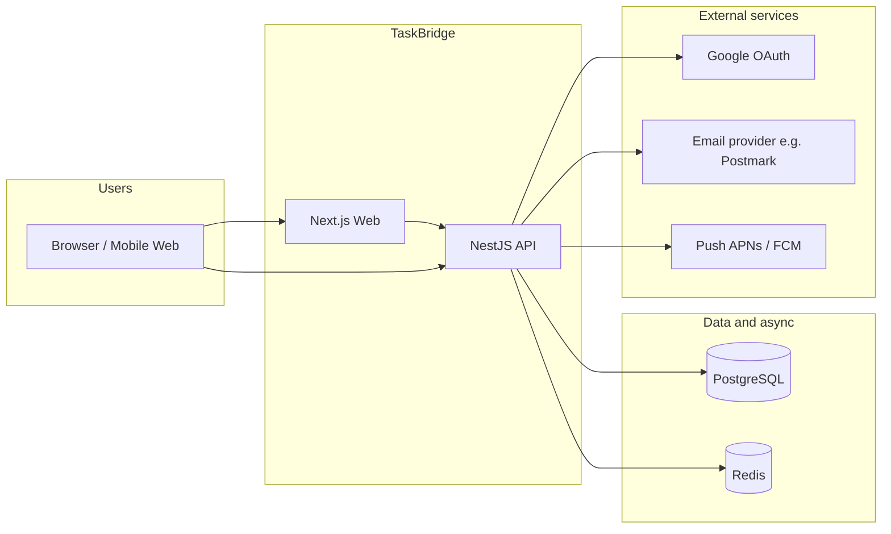
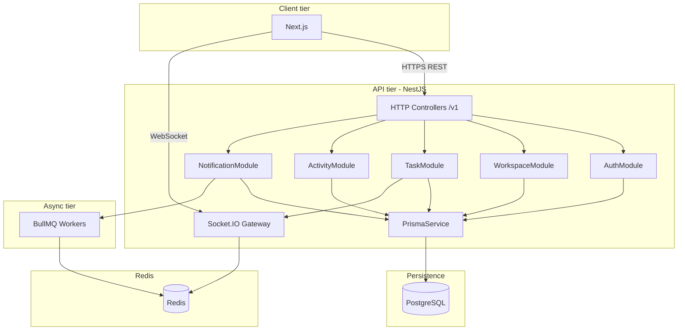

# TaskBridge — High-Level Design (HLD)

| Field | Value |
|-------|--------|
| **Product** | TaskBridge — team task coordination (MVP) |
| **PRD** | `PRD.md` v2.0 |
| **Related** | `docs/stack-selection.md`, `docs/domain-model.md`, `docs/api-contract.md`, `docs/api/openapi.yaml` |
| **Status** | Living document — update when deployment topology or stack versions change |

---

## 1. Purpose

This document describes the **high-level software architecture** of TaskBridge: major components, how they interact, and the **technology stack** chosen for the MVP. It is intended for engineers and stakeholders who need a single view of the system without implementation-level detail.

**Out of scope here:** Low-level class diagrams, detailed sequence diagrams for every endpoint, and cloud-specific runbooks (those belong in separate ops/runbook docs when environments exist).

---

## 2. Architectural goals

| Goal | How it is addressed |
|------|------------------------|
| Fast MVP delivery | TypeScript end-to-end (web + API), shared package for types/constants |
| Workspace isolation | Every workspace-scoped request validates membership; data keyed by `workspace_id` |
| Realtime UX (PRD §9.2) | Socket.IO gateway in API; clients subscribe per workspace |
| Reliable reminders | Redis-backed job queue (BullMQ) for 24h-before-due and overdue jobs |
| Auditable tasks | Append-only `TaskActivity` + REST activity endpoint |
| Future mobile clients | REST `/v1` + stable realtime event contract (`docs/api-contract.md`) |

**Product constraints (PRD v2.0):** Max **5** members per workspace (active + invited); **all** members can read **all** tasks in a workspace; MVP sends **one** reminder at **24h** before due (48h deferred).

---

## 3. System context

External actors and systems interact with TaskBridge through the web app, future native apps, and provider integrations.



---

## 4. Technology stack

### 4.1 Summary

| Layer | Technology | Role |
|-------|------------|------|
| **Web UI** | **Next.js** (App Router), **React**, **TypeScript** | SSR/SPA dashboard, auth UI, task views |
| **Backend API** | **NestJS**, **TypeScript** | REST `/v1`, auth, domain modules, Socket.IO gateway |
| **Database** | **PostgreSQL** | Relational source of truth for users, workspaces, tasks, activities, preferences |
| **ORM** | **Prisma** | Schema, migrations, type-safe queries (`apps/api/prisma/`) |
| **Cache / queue** | **Redis** + **BullMQ** | Job scheduling (reminders, overdue), optional caching |
| **Realtime** | **Socket.IO** (NestJS WebSocket gateway) | Task lifecycle events to connected clients |
| **Auth** | **JWT** (access/refresh), **Google OAuth** (Passport) | Session model per `docs/api-contract.md` |
| **Email** | Provider abstraction (**Postmark** primary; **SendGrid** alternative) | Transactional mail for invites, reminders |
| **Monorepo** | **npm workspaces** | `apps/web`, `apps/api`, `packages/shared` |
| **Local infra** | **Docker Compose** | PostgreSQL 16, Redis 7 (`infra/docker-compose.yml`) |

### 4.2 Representative versions (scaffold)

Versions drift over time; treat `package.json` files as source of truth.

| Component | Notes |
|-----------|--------|
| Node.js | 20+ (local dev) |
| Next.js | ^15.x (`apps/web`) |
| React | ^19.x (`apps/web`) |
| NestJS | ^11.x (`apps/api`) |
| Prisma | ^6.x (`apps/api`) |
| PostgreSQL | 16 (Compose image) |
| Redis | 7-alpine (Compose image) |

### 4.3 Stack rationale (abbreviated)

Full trade-off discussion lives in `docs/stack-selection.md`. In short: **one language (TypeScript)** reduces context switching; **NestJS** maps cleanly to modular domains (auth, workspace, task, activity, notification, realtime); **PostgreSQL + Prisma** fits relational integrity and migrations; **Redis + BullMQ** supports delayed and repeatable jobs for notification policy; **Socket.IO** matches PRD realtime expectations without locking out future SSE alternatives at the contract layer.

---

## 5. Logical architecture

### 5.1 Monorepo layout

```
apps/web/          # Next.js — UI, calls API (BFF optional later)
apps/api/          # NestJS — REST, Prisma, jobs, gateway
packages/shared/   # Shared enums/constants/types for API + web
infra/             # Docker Compose for dev databases
docs/              # PRD, OpenAPI, contracts, HLD
```

### 5.2 Backend module boundaries (NestJS)

Aligned with `docs/stack-selection.md` **Service Boundaries**:

| Module | Responsibility |
|--------|----------------|
| **Auth** | Login, refresh, Google OAuth callback, `GET /v1/auth/me` |
| **Workspace** | CRUD workspace, members, invitations, **cap ≤ 5** |
| **Task** | CRUD, filters/views, assignment, status transitions per matrix |
| **Activity** | Immutable `TaskActivity` writes on domain actions; `GET .../activity` |
| **Notification** | Read/update preferences; enqueue/trigger email + push per rules |
| **Realtime** | Emit workspace-scoped events (`task.created`, `task.status_changed`, …) |

### 5.3 Component diagram



*Note:* Exact worker process topology (in-process vs separate Node worker) is an implementation choice; logically, **BullMQ** consumes Redis and invokes notification delivery.

---

## 6. Data architecture

- **Primary store:** PostgreSQL holds all durable entities (`User`, `Workspace`, `Membership`, `Invitation`, `Task`, `TaskActivity`, `NotificationPreference`, etc.) per `docs/domain-model.md`.
- **Migrations:** Prisma migrate (`apps/api/prisma/migrations/`).
- **Workspace isolation:** Foreign keys and application guards ensure queries are scoped by `workspace_id` and membership.
- **Redis:** Used for BullMQ queues and optionally pub/sub or Socket.IO adapter scaling later; not the system of record.

---

## 7. API and integration style

| Aspect | Standard |
|--------|----------|
| REST base path | `/v1` |
| Payloads | JSON |
| IDs | UUID v4 |
| Timestamps | ISO-8601 UTC |
| Errors | `{ code, message, requestId }` |
| Contract | `docs/api/openapi.yaml` + `docs/api-contract.md` |

**Realtime:** Event types and envelope defined in `docs/api-contract.md` §8 (e.g. `task.status_changed` with `workspaceId` and payload).

---

## 8. Security (high level)

- **Transport:** TLS in production (HTTPS / WSS).
- **Authentication:** JWT bearer tokens on protected routes; refresh flow TBD in implementation.
- **Authorization:** Workspace membership check on all `{workspaceId}` routes; role-based rules for invites and cancellation (see `docs/api-contract.md`).
- **Secrets:** Environment variables (see `.env.example`, `apps/api/.env.example`); never commit secrets.

---

## 9. Deployment view (conceptual)

MVP development uses **Docker Compose** for Postgres and Redis only; **Next.js** and **NestJS** run as local Node processes (`npm run dev:web`, `npm run dev:api`).

A typical production deployment (not fixed by this repo) would separate:

- **Web:** Static/SSR hosting (e.g. Vercel, container, or Node host) for `apps/web`.
- **API:** Container or Node host for `apps/api` with env for `DATABASE_URL`, Redis URL, JWT secrets, OAuth client IDs.
- **Data:** Managed PostgreSQL + managed Redis (or self-hosted equivalents).
- **Jobs:** Same API process or dedicated worker replicas connected to the same Redis and DB.

Horizontal scaling of Socket.IO may require a **Redis adapter** for multi-instance fan-out (future hardening).

---

## 10. Traceability

| HLD topic | Design artifact |
|-----------|-----------------|
| Features ↔ endpoints | `docs/traceability-matrix.md` |
| Entities | `docs/domain-model.md` |
| REST + schemas | `docs/api/openapi.yaml` |
| Behavioral rules | `docs/api-contract.md` |
| Stack decision | `docs/stack-selection.md` |

---

## 11. Revision history

| Version | Date | Summary |
|---------|------|---------|
| 1.0 | April 2026 | Initial HLD: context, stack, components, data, deployment sketch |
