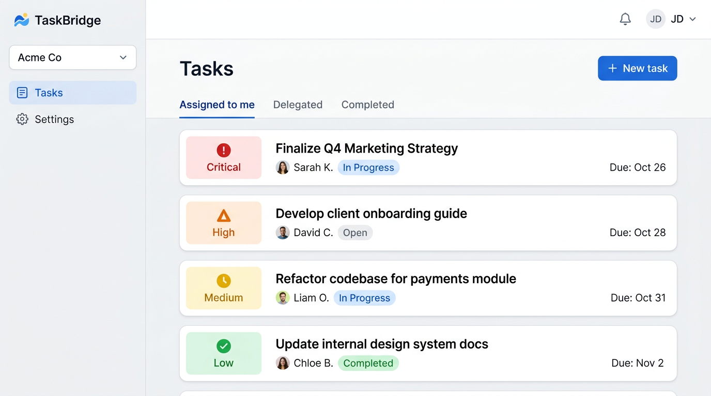
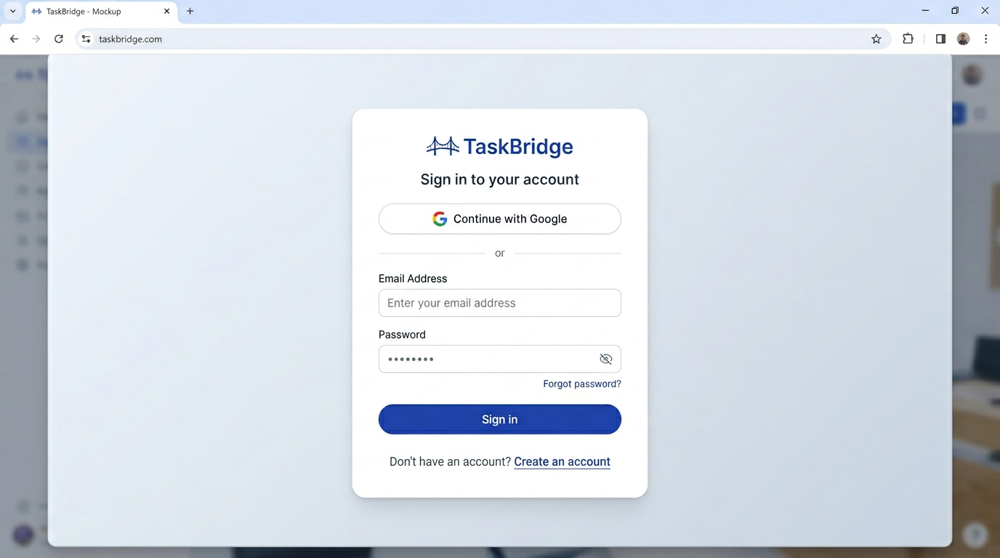
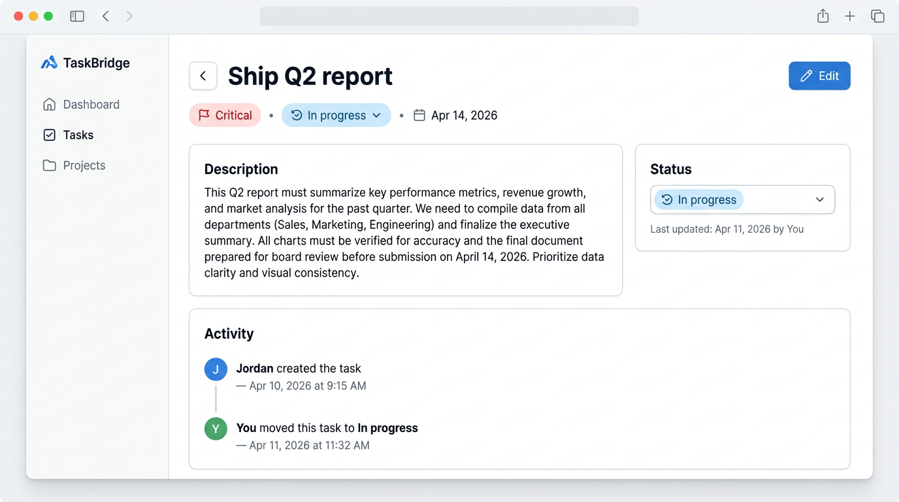

# Task 2 — UX mocks (MVP web) — started

## Scope
Deliverables align with `PRD.md` §8 (UX & design requirements), `docs/domain-model.md`, and the unified dashboard story (Assigned to me / Delegated / Completed).

## Definition of done
- [x] Screen inventory and navigation model documented
- [x] Priority visuals per PRD (Critical → Low)
- [x] Low-fidelity wireframes (ASCII) for core flows
- [x] Reference visual mocks (generated) for stakeholder review — see repository images or regenerate from descriptions below

## Design tokens (MVP)
| Token | Use |
|-------|-----|
| Priority **Critical** | Red badge + alert icon |
| Priority **High** | Orange badge |
| Priority **Medium** | Yellow/amber badge |
| Priority **Low** | Green badge |
| Layout (web) | Left sidebar: workspace + nav; main: segmented control + task list |
| Layout (mobile) | Bottom tab bar; full-width cards |

## Screen inventory
1. **Auth** — Email + Google; password or magic link per backend choice
2. **Workspace onboarding** — Create workspace or accept invite
3. **Dashboard (default)** — Segment: **Assigned to me** (sort due ↑)
4. **Dashboard** — **Delegated** (assigned by me)
5. **Dashboard** — **Completed** (reverse chronological + date range filter)
6. **Optional filter** — All workspace tasks (PRD v2.0: filter on shared list)
7. **Create / edit task** — Title, description, assignee, due, priority
8. **Task detail** — Status transitions, activity feed, cancel with reason
9. **Workspace settings** — Members (cap 5), invite, roles
10. **Notification preferences** — Push / email toggles per workspace

## Navigation model
- **Desktop:** Persistent sidebar: workspace name, switcher, primary nav (Tasks, Settings), user menu
- **Mobile:** Bottom tabs: Tasks | Activity (optional MVP) | Settings; FAB or top bar for “New task”

---

## Wireframes (low-fidelity)

### A. Sign in
```
┌─────────────────────────────────────────┐
│            TaskBridge                    │
│                                         │
│   [ Continue with Google ]              │
│                                         │
│   ─────────── or ───────────            │
│                                         │
│   Email                                 │
│   [________________________]            │
│   Password                              │
│   [________________________]            │
│                                         │
│   [ Sign in ]          Forgot password? │
│                                         │
│   New here? Create an account           │
└─────────────────────────────────────────┘
```

### B. Dashboard — Assigned to me (default)
```
┌──────────┬──────────────────────────────────────────────────┐
│ Acme Co ▼│  Tasks                              [ + New task ] │
│──────────│──────────────────────────────────────────────────│
│ Tasks    │  ( Assigned to me ) ( Delegated ) ( Completed )   │
│ Settings │──────────────────────────────────────────────────│
│          │  ┌────────────────────────────────────────────┐  │
│          │  │ [!] Ship Q2 report          Apr 14   ●●●  │  │
│          │  │     You · In progress · Due in 2d        │  │
│          │  └────────────────────────────────────────────┘  │
│          │  ┌────────────────────────────────────────────┐  │
│          │  │ [H] Client contract         Apr 20   ●●   │  │
│          │  │     Alex · Open                          │  │
│          │  └────────────────────────────────────────────┘  │
└──────────┴──────────────────────────────────────────────────┘
  ●●● Critical  ●● High  ● Medium  ● Low (badge shapes from PRD)
```

### C. Create task (modal or drawer)
```
┌─────────────────────────────────────┐
│ New task                       [×]  │
│─────────────────────────────────────│
│ Title *                             │
│ [________________________________]  │
│ Description                         │
│ [________________________________]  │
│ [________________________________]  │
│ Assignee *        [ Alex Chen    ▼] │
│ Due date          [ Apr 20, 2026 📅]│
│ Priority *        [ High         ▼] │
│                                     │
│ [ Cancel ]              [ Create ]  │
└─────────────────────────────────────┘
```

### D. Task detail + activity
```
┌─────────────────────────────────────────────────────────────┐
│ ← Back    Ship Q2 report          [ Edit ]                  │
│─────────────────────────────────────────────────────────────│
│ [!] Critical   ·   In progress   ·   Due Apr 14, 2026      │
│ Assigned to you · Created by Jordan                          │
│─────────────────────────────────────────────────────────────│
│ Description                                                 │
│ Consolidate figures from…                                   │
│─────────────────────────────────────────────────────────────│
│ Status  [ Open ▼ ]  (assignee: In progress / Completed)      │
│─────────────────────────────────────────────────────────────│
│ Activity                                                    │
│ · Jordan created the task — Apr 10                          │
│ · You moved to In progress — Apr 11                         │
└─────────────────────────────────────────────────────────────┘
```

### E. Workspace members (cap 5)
```
┌─────────────────────────────────────┐
│ Members                             │
│ 3 of 5 seats used                   │
│─────────────────────────────────────│
│ ● Jordan (admin)                    │
│ ● Alex                                │
│ ● Sam                                 │
│                                     │
│ [ + Invite by email ]               │
│                                     │
│ (At cap: “Workspace is full…” )    │
└─────────────────────────────────────┘
```

### F. Mobile — bottom navigation
```
┌─────────────────────────┐
│ TaskBridge   Acme ▼     │
│ ( Assigned to me ) ...  │
│ ┌─────────────────────┐ │
│ │ Task cards…         │ │
│ └─────────────────────┘ │
│                         │
│ ─────────────────────── │
│ [ Tasks ] [ Done? ] [ ⚙ ]│
└─────────────────────────┘
```

## Open decisions (for implementation)
- Fourth tab vs. **All tasks** filter-only (PRD allows either)
- Auth: password vs. magic link for email
- Whether MVP mobile web uses bottom tabs or hamburger-only (PRD shows bottom tabs)

## Reference visuals
Static mocks live in `docs/ux-assets/` for layout and hierarchy; refine spacing and tokens in Figma when you formalize the design system.






